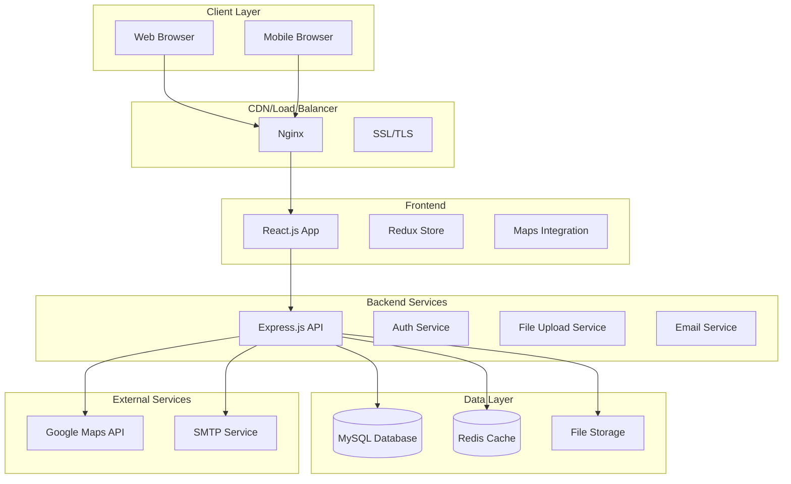
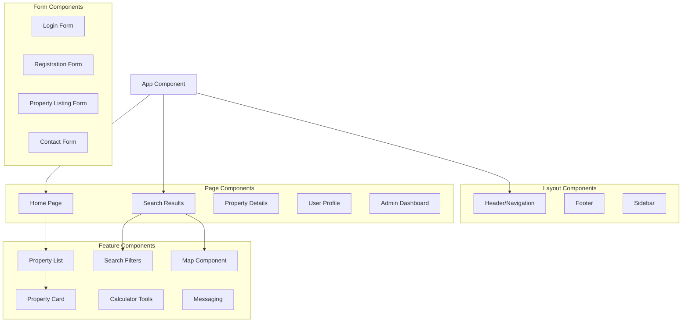

# Design Document

## Overview

The real estate portal will be built as a modern, scalable web application using a microservices-inspired architecture with clear separation between frontend and backend concerns. The system will handle high-volume property data, user interactions, and media content while maintaining performance and security standards.

The architecture follows RESTful API principles with JWT-based authentication, role-based access control, and comprehensive caching strategies. The frontend will be a responsive React.js application with state management, while the backend will be a Node.js/Express.js API server with MySQL database and Redis caching layer.

## Architecture

### High-Level Architecture



### Technology Stack Implementation

**Frontend Stack:**
- React.js 18+ with functional components and hooks
- Tailwind CSS for utility-first styling
- Redux Toolkit for state management
- React Router for client-side routing
- Google Maps JavaScript API for map integration
- Axios for HTTP client communication

**Backend Stack:**
- Node.js 18+ with Express.js framework
- JWT for stateless authentication
- Multer for file upload handling
- bcrypt for password hashing
- express-rate-limit for API rate limiting
- helmet for security headers

**Database Design:**
- MySQL 8+ for relational data with proper indexing
- Redis for session storage and caching
- File system or cloud storage for media files

## Components and Interfaces

### Frontend Components Architecture



### Backend API Structure

**Core API Endpoints:**

```
Authentication & Users:
POST   /api/auth/register
POST   /api/auth/login
POST   /api/auth/logout
GET    /api/auth/profile
PUT    /api/auth/profile

Properties:
GET    /api/properties
POST   /api/properties
GET    /api/properties/:id
PUT    /api/properties/:id
DELETE /api/properties/:id
POST   /api/properties/:id/images
GET    /api/properties/search

Users & Roles:
GET    /api/users
GET    /api/users/:id
PUT    /api/users/:id/role
DELETE /api/users/:id

Communications:
POST   /api/inquiries
GET    /api/inquiries
POST   /api/messages
GET    /api/messages/:conversationId

Admin:
GET    /api/admin/dashboard
GET    /api/admin/analytics
POST   /api/admin/moderate/:type/:id
```

### Service Layer Architecture

**Authentication Service:**
- JWT token generation and validation
- Role-based access control middleware
- Password hashing and verification
- Session management with Redis

**Property Service:**
- CRUD operations for properties
- Search and filtering logic
- Image upload and processing
- Location geocoding integration

**User Service:**
- User profile management
- Role assignment and validation
- Saved searches and favorites
- Activity tracking

**Communication Service:**
- Inquiry handling and routing
- In-app messaging system
- Email notification triggers
- Lead tracking and analytics

## Data Models

### Database Schema

```sql
-- Users table with role-based access
CREATE TABLE users (
    id INT PRIMARY KEY AUTO_INCREMENT,
    email VARCHAR(255) UNIQUE NOT NULL,
    password_hash VARCHAR(255) NOT NULL,
    role ENUM('buyer', 'owner', 'agent', 'builder', 'admin') NOT NULL,
    first_name VARCHAR(100) NOT NULL,
    last_name VARCHAR(100) NOT NULL,
    phone VARCHAR(20),
    profile_image VARCHAR(255),
    is_verified BOOLEAN DEFAULT FALSE,
    is_active BOOLEAN DEFAULT TRUE,
    created_at TIMESTAMP DEFAULT CURRENT_TIMESTAMP,
    updated_at TIMESTAMP DEFAULT CURRENT_TIMESTAMP ON UPDATE CURRENT_TIMESTAMP,
    INDEX idx_email (email),
    INDEX idx_role (role)
);

-- Properties table with comprehensive details
CREATE TABLE properties (
    id INT PRIMARY KEY AUTO_INCREMENT,
    user_id INT NOT NULL,
    title VARCHAR(255) NOT NULL,
    description TEXT,
    property_type ENUM('apartment', 'house', 'commercial', 'land') NOT NULL,
    listing_type ENUM('sale', 'rent') NOT NULL,
    status ENUM('new', 'resale', 'under_construction') NOT NULL,
    price DECIMAL(15,2) NOT NULL,
    area_sqft INT,
    bedrooms INT,
    bathrooms INT,
    address TEXT NOT NULL,
    city VARCHAR(100) NOT NULL,
    state VARCHAR(100) NOT NULL,
    postal_code VARCHAR(20),
    latitude DECIMAL(10, 8),
    longitude DECIMAL(11, 8),
    amenities JSON,
    is_featured BOOLEAN DEFAULT FALSE,
    is_active BOOLEAN DEFAULT TRUE,
    views_count INT DEFAULT 0,
    created_at TIMESTAMP DEFAULT CURRENT_TIMESTAMP,
    updated_at TIMESTAMP DEFAULT CURRENT_TIMESTAMP ON UPDATE CURRENT_TIMESTAMP,
    FOREIGN KEY (user_id) REFERENCES users(id) ON DELETE CASCADE,
    INDEX idx_user_id (user_id),
    INDEX idx_property_type (property_type),
    INDEX idx_listing_type (listing_type),
    INDEX idx_city (city),
    INDEX idx_price (price),
    INDEX idx_location (latitude, longitude)
);

-- Property images table
CREATE TABLE property_images (
    id INT PRIMARY KEY AUTO_INCREMENT,
    property_id INT NOT NULL,
    image_url VARCHAR(500) NOT NULL,
    alt_text VARCHAR(255),
    display_order INT DEFAULT 0,
    created_at TIMESTAMP DEFAULT CURRENT_TIMESTAMP,
    FOREIGN KEY (property_id) REFERENCES properties(id) ON DELETE CASCADE,
    INDEX idx_property_id (property_id)
);

-- Inquiries and communications
CREATE TABLE inquiries (
    id INT PRIMARY KEY AUTO_INCREMENT,
    property_id INT NOT NULL,
    inquirer_id INT,
    name VARCHAR(100) NOT NULL,
    email VARCHAR(255) NOT NULL,
    phone VARCHAR(20),
    message TEXT NOT NULL,
    status ENUM('new', 'contacted', 'closed') DEFAULT 'new',
    created_at TIMESTAMP DEFAULT CURRENT_TIMESTAMP,
    FOREIGN KEY (property_id) REFERENCES properties(id) ON DELETE CASCADE,
    FOREIGN KEY (inquirer_id) REFERENCES users(id) ON DELETE SET NULL,
    INDEX idx_property_id (property_id),
    INDEX idx_status (status)
);

-- User favorites/saved properties
CREATE TABLE user_favorites (
    id INT PRIMARY KEY AUTO_INCREMENT,
    user_id INT NOT NULL,
    property_id INT NOT NULL,
    created_at TIMESTAMP DEFAULT CURRENT_TIMESTAMP,
    FOREIGN KEY (user_id) REFERENCES users(id) ON DELETE CASCADE,
    FOREIGN KEY (property_id) REFERENCES properties(id) ON DELETE CASCADE,
    UNIQUE KEY unique_user_property (user_id, property_id)
);

-- Saved searches
CREATE TABLE saved_searches (
    id INT PRIMARY KEY AUTO_INCREMENT,
    user_id INT NOT NULL,
    search_name VARCHAR(100) NOT NULL,
    search_criteria JSON NOT NULL,
    created_at TIMESTAMP DEFAULT CURRENT_TIMESTAMP,
    FOREIGN KEY (user_id) REFERENCES users(id) ON DELETE CASCADE,
    INDEX idx_user_id (user_id)
);
```

### Redis Caching Strategy

**Cache Keys Structure:**
```
user:session:{userId}           - User session data (TTL: 24h)
property:details:{propertyId}   - Property details cache (TTL: 1h)
search:results:{searchHash}     - Search results cache (TTL: 15min)
user:favorites:{userId}         - User favorites list (TTL: 1h)
analytics:daily:{date}          - Daily analytics data (TTL: 7d)
```

## Error Handling

### API Error Response Format

```json
{
  "success": false,
  "error": {
    "code": "VALIDATION_ERROR",
    "message": "Invalid input data",
    "details": {
      "field": "email",
      "reason": "Invalid email format"
    }
  },
  "timestamp": "2024-01-15T10:30:00Z"
}
```

### Error Categories and Handling

**Authentication Errors (401):**
- Invalid credentials
- Expired tokens
- Insufficient permissions

**Validation Errors (400):**
- Missing required fields
- Invalid data formats
- Business rule violations

**Resource Errors (404):**
- Property not found
- User not found
- Invalid endpoints

**Server Errors (500):**
- Database connection issues
- External service failures
- Unexpected application errors

### Frontend Error Handling

- Global error boundary for React components
- Toast notifications for user feedback
- Retry mechanisms for failed API calls
- Graceful degradation for offline scenarios

## Testing Strategy

### Backend Testing Approach

**Unit Tests:**
- Service layer business logic
- Utility functions and helpers
- Authentication middleware
- Data validation functions

**Integration Tests:**
- API endpoint functionality
- Database operations
- External service integrations
- Authentication flows

**Test Structure:**
```
tests/
├── unit/
│   ├── services/
│   ├── middleware/
│   └── utils/
├── integration/
│   ├── api/
│   ├── database/
│   └── auth/
└── fixtures/
    ├── users.json
    └── properties.json
```

### Frontend Testing Approach

**Component Tests:**
- React component rendering
- User interaction handling
- State management
- Form validation

**E2E Tests:**
- Critical user journeys
- Property search and filtering
- User registration and login
- Property listing creation

### Performance Testing

**Load Testing Scenarios:**
- Concurrent user searches
- Property image uploads
- Database query performance
- Cache hit/miss ratios

**Monitoring Metrics:**
- API response times
- Database query performance
- Memory and CPU usage
- Cache effectiveness

## Security Implementation

### Authentication Security

- JWT tokens with short expiration (15 minutes)
- Refresh token rotation
- Rate limiting on auth endpoints
- Account lockout after failed attempts

### Data Protection

- Input sanitization and validation
- SQL injection prevention with parameterized queries
- XSS protection with content security policies
- CSRF protection with tokens

### File Upload Security

- File type validation
- File size limits
- Virus scanning integration
- Secure file storage with access controls

### API Security

- HTTPS enforcement
- CORS configuration
- Request rate limiting
- API key validation for external services

This design provides a solid foundation for building a scalable, secure, and maintainable real estate portal that meets all the specified requirements while following industry best practices.